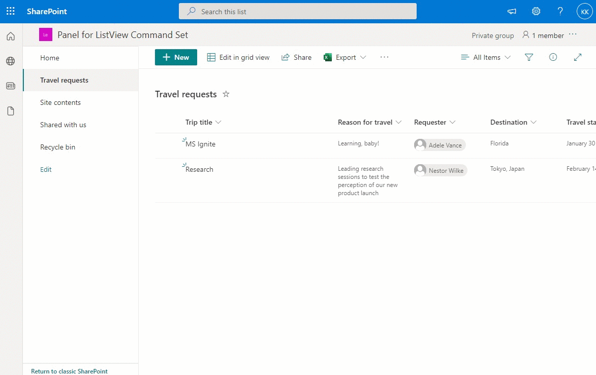

# Panel

## Summary

This control renders stateful Panel that can be used with [ListView Command Set extensions](https://docs.microsoft.com/en-us/sharepoint/dev/spfx/extensions/get-started/building-simple-cmdset-with-dialog-api). It may optionally refresh the list view page after the panel is closed.
It opens when a List Command button is clicked, and closes using either Panel's close button, or on "light dismiss".

It may be used to replace Dialog component, ensuring the User Interface is consistent with that of SharePoint Online.



## Compatibility


-Incompatible-red.svg "SharePoint Server 2016 Feature Pack 2 requires SPFx 1.1")


## Applies to

* [SharePoint Framework](https://docs.microsoft.com/sharepoint/dev/spfx/sharepoint-framework-overview)
* [Microsoft 365 tenant](https://docs.microsoft.com/sharepoint/dev/spfx/set-up-your-developer-tenant)

> Get your own free development tenant by subscribing to [Microsoft 365 developer program](http://aka.ms/o365devprogram)

## Solution

Solution|Author(s)
--------|---------
react-command-panel | [Kinga Kazala](https://github.com/kkazala/) ([@kinga_kazala](https://twitter.com/kinga_kazala))

## Version history

Version|Date|Comments
-------|----|--------
1.0|January 13, 2022|Initial release

## Prerequisites

SPFx 1.13 does not support local workbench. To test this solution you must have a SharePoint site.

## Minimal Path to Awesome

* Clone this repository
* Ensure that you are at the solution folder
* in the command-line run:
  * **nvm use 14.15.0**
  * **npm install**
  * **gulp serve --nobrowser**
  * debug

See [Debugging SPFx 1.13+ solutions](https://dev.to/kkazala/debugging-spfx-113-solutions-11cd) on creating debug configurations.

## Features

Opening and closing Panel controls is a no-brainer as long as it is controlled by a parent component.
In the case of a ListView Command Set, this requires slightly more effort.

This extension illustrates the following concepts:

* Panel component with (optionally, recommended) Error Boundary
* Configurable logging using  @pnp/logging Logger
* Example component using Panel, with a Toggle control to optionally refresh the page when the panel is closed

### React Error Boundary

As of React 16, it is recommended to use error boundaries for handling errors in the component tree.
Error boundaries **do not catch** errors for event handlers, asynchronous code, server side rendering and errors thrown in the error boundary itself; try/catch is still required in these cases.
This solution uses [react-error-boundary](https://www.npmjs.com/package/react-error-boundary) component.

### PnP Logger

Logging is implemented using [@pnp/logging](https://pnp.github.io/pnpjs/logging) module. [Log level](https://pnp.github.io/pnpjs/logging/#log-levels) is defined as a customizer property, which allows changing log level of productively deployed solution, in case troubleshooting is required.

Errors returned by [@pnp/sp](https://pnp.github.io/pnpjs/sp/#pnpsp) commands are handled using `Logger.error(e)`, which parses and logs the error message. If the error message should be displayed in the UI, use the [handleError](src\common\errorhandler.ts) function  implemented based on [Reading the Response](https://pnp.github.io/pnpjs/concepts/error-handling/#reading-the-response) example.

## Debug URL for testing

Here's a debug URL for testing around this sample.

```
?loadSPFX=true&debugManifestsFile=https://localhost:4321/temp/manifests.js&customActions={\"03a2395f-4448-4d30-a540-6b22c79c255a\":{\"location\":\"ClientSideExtension.ListViewCommandSet.CommandBar\",\"properties\":{\"sampleTextOne\":\"Travel guidelines\",\"sampleTextTwo\":\"Trip report\", \"logLevel\":\"1\"}}}
```

## Deploy

In case you are not using the elements.xml file for deployment, you may add the custom action using `Add-PnPCustomAction`

```powershell
Add-PnPCustomAction -Title "Panel" -Name "panl" -Location "ClientSideExtension.ListViewCommandSet.CommandBar" -ClientSideComponentId "xxxxxxxx-xxxx-xxxx-xxxx-xxxxxxxxxxxx" -ClientSideComponentProperties "{""sampleTextOne"":""Travel guidelines"", ""sampleTextTwo"":""Trip report"", ""logLevel"":""3""}" -RegistrationId 100 -RegistrationType List -Scope Web
```

Updating the [logLevel](https://pnp.github.io/pnpjs/logging/#log-levels) in an already deployed solution is done with:

```powershell
$ca=Get-PnPCustomAction -Scope Web -Identity "xxxxxxxx-xxxx-xxxx-xxxx-xxxxxxxxxxxx"
$ca.ClientSideComponentProperties="{""sampleTextOne"":""Travel guidelines"", ""sampleTextTwo"":""Trip report"", ""logLevel"":""1""}"
$ca.Update()
```

## Read more

* [Getting started with SharePoint Framework](https://docs.microsoft.com/en-us/sharepoint/dev/spfx/set-up-your-developer-tenant)
* [Microsoft 365 Patterns and Practices](https://aka.ms/m365pnp) - Guidance, tooling, samples and open-source controls for your Microsoft 365 development
* [Debugging SPFx 1.13+ solutions](https://dev.to/kkazala/debugging-spfx-113-solutions-11cd)
* [PnP Error Handling](https://pnp.github.io/pnpjs/concepts/error-handling/)
* [React Error Boundaries](https://reactjs.org/docs/error-boundaries.html) in React 16
* [I Made a Tool to Generate Images Using Office UI Fabric Icons](https://joshmccarty.com/made-tool-generate-images-using-office-ui-fabric-icons/) to generate CommandSet icons easily

## Disclaimer

**THIS CODE IS PROVIDED *AS IS* WITHOUT WARRANTY OF ANY KIND, EITHER EXPRESS OR IMPLIED, INCLUDING ANY IMPLIED WARRANTIES OF FITNESS FOR A PARTICULAR PURPOSE, MERCHANTABILITY, OR NON-INFRINGEMENT.**

## Help

We do not support samples, but we this community is always willing to help, and we want to improve these samples. We use GitHub to track issues, which makes it easy for  community members to volunteer their time and help resolve issues.

You can try looking at [issues related to this sample](https://github.com/pnp/sp-dev-fx-extensions/issues?q=label%3AYOUR-SOLUTION-NAME) to see if anybody else is having the same issues.

You can also try looking at [discussions related to this sample](https://github.com/pnp/sp-dev-fx-extensions/discussions?discussions_q=label%3AYOUR-SOLUTION-NAME) and see what the community is saying.

If you encounter any issues while using this sample, [create a new issue](https://github.com/pnp/sp-dev-fx-extensions/issues/new?assignees=&labels=Needs%3A+Triage+%3Amag%3A%2Ctype%3Abug-suspected&template=bug-report.yml&sample=YOUR-SOLUTION-NAME&authors=@YOURGITHUBUSERNAME&title=YOUR-SOLUTION-NAME%20-%20).

For questions regarding this sample, [create a new question](https://github.com/pnp/sp-dev-fx-extensions/issues/new?assignees=&labels=Needs%3A+Triage+%3Amag%3A%2Ctype%3Abug-suspected&template=question.yml&sample=YOUR-SOLUTION-NAME&authors=@YOURGITHUBUSERNAME&title=YOUR-SOLUTION-NAME%20-%20).

Finally, if you have an idea for improvement, [make a suggestion](https://github.com/pnp/sp-dev-fx-extensions/issues/new?assignees=&labels=Needs%3A+Triage+%3Amag%3A%2Ctype%3Abug-suspected&template=suggestion.yml&sample=YOUR-SOLUTION-NAME&authors=@YOURGITHUBUSERNAME&title=YOUR-SOLUTION-NAME%20-%20).


